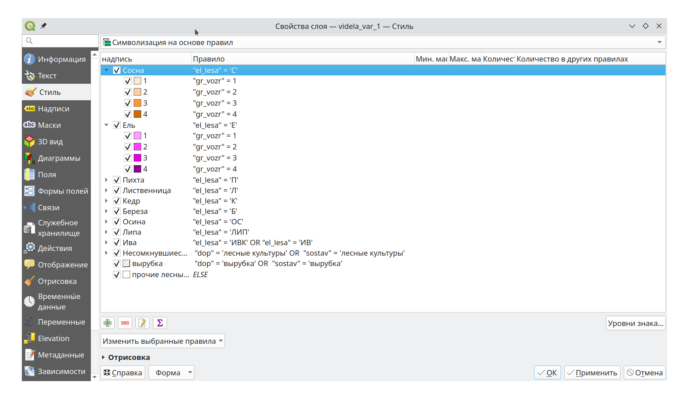
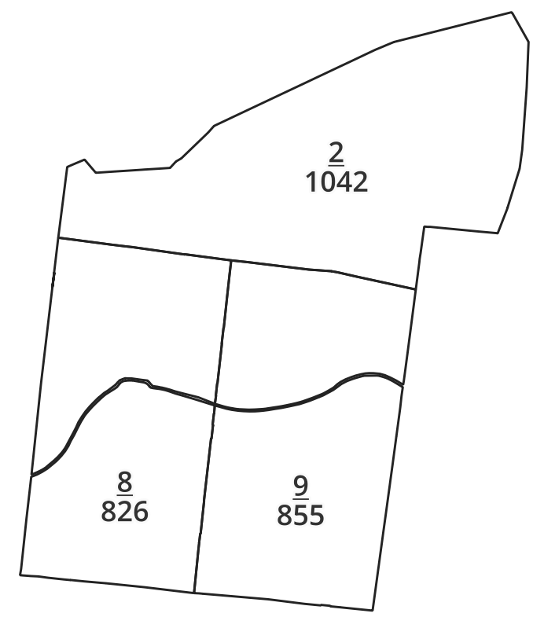
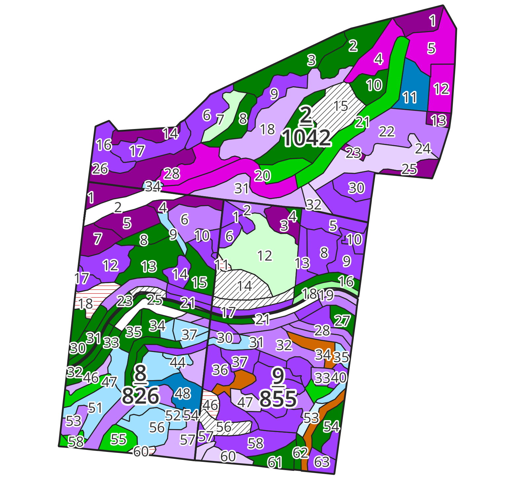
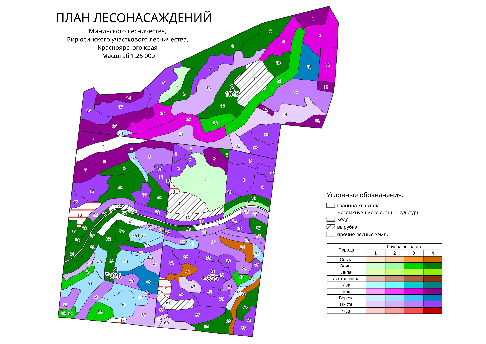

# Создание плана лесонасаждений

::: {.callout-note}
## Загрузите файлы!
Для выполнения задания из этого подраздела необходимо загрузить файлы по [ссылке 1](https://github.com/agoroshko/qgis_for_beginners/tree/main/files) или [ссылке 2](https://disk.yandex.ru/d/zs7hHe9IiWQXQA) и создать новый проект с файлами "kvartala.shp" и "videla.shp".
:::

В лесном хозяйстве широко используются планы лесонасаждений. Такие планы окрашиваются на основе сочетания преобладающей породы и группы возраста: молодняки; средневозрастные; приспевающие; спелые и перестойные. Создать такую классификацию возможно используя стиль **"Символизация на основе правил"** с вложенными условиями (@fig-conditions).

{#fig-conditions}

Легенда планов часто представлена в виде матрицы, где по вертикали указывается преобладающая порода, а по горизонтали - класс возраста. Каждому сочетанию "порода-класс возраста" соответствует определенный оттенок цвета (@fig-matrix_legend).

{#fig-matrix_legend width=4.5in height=3in}

Каждый квартал имеет подпись в виде дроби, где в числителе указывается номер квартала, а в знаменателе - площадь в гектарах. Такие подписи в QGIS возможно создать с использованием **HTML-тегов**: нижнее подчеркивание (`<u> </u>`) и перенос строки (`
`). Что бы HTML-теги начали работать, в пункте **"Надписи" > "Текст"** необходио поставить чек-бокс **"Разрешить форматирование HTML"**. Выражение `'<u>'  || "kvartal" || '</u>
' || "area_ha"` будет отображаться на карте в виде дроби $\frac{номер\:квартала}{площадь,\:га}$ для каждого квартала (@fig-kvartal_labels).

{#fig-kvartal_labels}

Для подписи выделов так же используют доробь вида $\frac{номер\:выдела - класс\:возраста}{площадь,\:га - класс\:бонитета}$, однако такая подпись занимает много место из-за чего подписи небольших выдeлов при мелких масштабах накладываются друг на друга или не отображаются (в зависимости от настроек размещения подписей) поэтому в текущем примере выдела подписываются одной цифрой - номером выдела.

## Применение сохраненных настроек отображения

В QGIS существует возможность сохранять настройки отображения слоя (стили, подписи и др.) в отдельный файл с расшерением **".qml"** а так же использовать их повторно в новых проектах. Перечисленные выше настройки плана лесонасаждений были сохранены в файлы **"style_kvartala.qml"** и **"style_videla.qml"**. Для создания плана лесонасаждений достаточно применить их к слоям "kvartala" и "videla". Перейдите в **"Свойства..." слоя > "Стиль" > "Форма" > "Загрузить стиль"**. В открывшемся окне "Управление стилями" выберите и загрузите необходимый файл стиля (напротив пунктов "Стиль" и "Надписи" должны быть установлены чек-боксы). В результате к слою будут применены сохраненные ранее стили и подписи объектов (@vid-apply_styles). 

{#vid-apply_styles}

::: {#task-task .callout-tip}
Примените сохраненные стили "style_kvartala.qml" и "style_videla.qml" к слоям "kvartala" и "videla" соответственно, как показано выше. Результат должен соотвествовать изображению ниже (@fig-apply_styles_result).

{#fig-apply_styles_result}
:::

## Создание макета

После настройки стилей отображения и подписей объектов переходят к созданию макета (@sec-make_layout). Планы лесонасаждений обычно печатают на листах больших форматов, следовательно для начала задается формат листа макета. Для этого нажмите на белый лист и в свойствах элемента выберите формат "А3". Во вкладке "Направляющие" задаются параметры направляющих линий, которые позволяют разместить объекты на карте более точно. Добавим направляющие в соответствии со стандартными отступами листа (слева - 2 см, остальные стороны - 0,5 см). Для этого в пункте "Горизонтальные направляющие" добавьте две направляющих со значениями 5 и 292 мм, в пункте "Вертикальные направляющие" так же две направляющие со значениями 20 и 415 мм. После чего добавьте карту так, что бы она не выходила за пределы заданных направляющих (область карты будет "приклеиваться" к красным линиями). В свойствах карты поставьте чек-бокс напротив подпункта "Рамка". Задайте масштаб карты 1:25 000 и разместите ее в середине листа (@vid-apply_layout).

{#vid-apply_layout}

::: {#task-task .callout-tip}
По примеру выше создайте макет, настройте направляющие и добавьте карту, задайте масштаб карты 1:25 000.
:::

## Добавление легенды

Создать легенду в виде матрицы средствами программы QGIS не представляется возможным, однако есть возможность создать легенду в стороннем редакторе, после чего импортировать ее в программу. Рассмотрим один из таких способов в следующей последовательности:

- **создание** легенды в табличном редакторе (Excel, Calc и др.);
- **экспорт** таблицы в формат HTML;
- **импорт** HTML в программу QGIS. 

Первые два этапа уже завершены и сохранены в файлах "Таблица условных обозначений пород**.ods**" и "Таблица условных обозначений пород**.html**". Для импорта таблицы в макет QGIS перейдите в пункт **"Добавить элемент" > "Добавить HTML"** после чего выделите область макета. Перейдите в "Свойства элемента", в пункте "Адрес" укажите путь к файлу "Таблица условных обозначений пород**.html**", таблица будет добавлена в макет. Для редактирования таблицы, сначала отредактируйте файл "Таблица условных обозначений пород**.ods**", сохраните в формате **.html** и укажите путь к новому файлу. Таблица будет заменена на отредактированную (@vid-html_table).

{#vid-html_table}

Оставшиеся объекты отображаются в виде отдельной легенды, для ее добавления перейдите в меню макета **"Добавить элемент" > "Добавить легенду"** и откройте свойства легенды (свойства элемента). Для отображения в легенде только видимых на карте объектов в подпункте **"Элементы легенды"** поставьте чек-бокс **"Отображать только элементы в охвате карты"**, после чего количество объектов в легенде уменьшится. Для возможности редактирования легенды, уберите чек-бокс "Автообновления", после чего появится возможность редактировать элементы. Удалите лишние и переименуйте оставшиеся элементы легенды. В подменю **"Свойства элемента"** добавьте заголовок **"Условные обозначения:"** (@vid-add_legend).

{#vid-add_legend}

После оформления легенды необходимо добавить две надписи в верхней части карты:

- **"ПЛАН ЛЕСОНАСАЖДЕНИЙ"** - размер шрифта 30, прописные буквы;
- **"Мининского лесничества, Бирюсинского участкового лесничества, Красноярского края Масштаб 1:25 000"** - размер шрифта 15.

Для вывода на печать готового плана лесонасаждений выберите пункт **"Макет" > "Экспорт в изображение..."**.

::: {#task-task .callout-tip}
По примеру выше добавьте легенду и надписи. Сохраните план в виде растрового изображения. Результат выполнения задания представлен на рисунке ниже (@fig-forest_map).

{#fig-forest_map}
:::

Видеоинструкция создания плана лесонасаждений расположена ниже (@vid-forest_map_video).

::: {#vid-forest_map_video}

Создание плана лесонасаждений в QGIS
:::

