# Мобильное приложение QField

Использование гис для мобильных устройств (смартфонов и планшетов) особенно удобно при выполнении полевых работ. Чаще всего мобильные ГИС выполняют 2 основные функции:

+ Ориентирование на местности. Поскольку прием GNSS сигнала не требует подключения к телефонной сети или интернету, ориентирование на местности возможно проводить в самых удаленных районах.

+ Сбор полевых данных. Большинство приложений позволяет добавлять новую информацию в ГИС на мобильном устройстве. Чаще всего это координаты объектов, атрибутивная информация, фотография. После записи, данные с мобильного устройства синхронизируются с базой данных на компьютере (через интернет или по проводу). Некоторые решения предлагают совместную работу и синхронизацию данных с нескольких устройств.

Мобильные ГИС приложение, как правило, интегрированы с тем или иным десктопным приложением. Такие пары образуют ArcGIS - ArcGIS Field Maps, NextGIS - NextGIS Mobile. Для QGIS существуют два приложения для мобильных устройств: [MerginMaps](https://merginmaps.com/) и [QField](https://qfield.org/). Оба приложения доступны на платформах Android и iOS, распространяются под открытой лицензией (AGPL-3.0 и GPLv2 соответственно) а так же имеют схожий функционал. В этом разделе будет рассмотено использование связки приложений QGIS - QField для ориентирования на местности и сбора полевых данных.

::: {.callout-note}
## Обратите внимание!
Дополнительную информацию о приложении QField можно получить на сайте проекта ["Картетика"](https://cartetika.ru/tpost/kugvp2hpe1-qfield-qgis-v-mobilnom-prilozhenii) а так же на официальном сайте приложения ["QField"](https://qfield.org/).
:::

Связь между QGIS и QField обеспечивает плагин "QField Sync" который устанавливается в программу QGIS (пункт **"Модули" > "Управление модулями..." > поиск модуля "QField Sync"**).

Плагин отвечает за настройку проекта, экспорт в QField а так же импорт из QField. Перенос проекта в мобильное приложение QField выполняется в несколько этапов:

+ Создание и настройка проекта в QGIS. На этом этапе выбираются необходимые слои а так же настраиваются их стили отображения.
+ Подготавливаются слои для сбора полевых данных. В зависимости от типа полевых данных это могут быть точечные, линейные или полигональные слои с настроенной таблицей атрибутов. Обычно такие слои создаются пустыми. Они предназначены для сбора полевых данных в QField.
+ Задаются настройки экспорта проекта в плагине "QField Sync". Проект и все файлы сохраняются в отдельную папку.
+ Сохраненный проект копируется на мобильное устройство, после чего производится импорт проекта в QField.
+ По окончании сбора полевых данных производят экспорт из QField в QGIS.

Рассмотрим эти этапы на примере решения задачи учета городских насаждений. В ходе решения задачи мы будем использовать приложение QField для отметки положения отдельных деревьев и записи их характеристик. Для начала создадим геоинформационную основу - новый проект с базовыми слоями, затем добавим слой для сбора данных и наконец экспортируем проект из QGIS в QField.

## Создание нового проекта в QGIS

Новый проект, в ходе выполнения заданий практикума, обучающимися создавался неоднократно, поэтому для этого этапа подробного описания не приводится.

::: {#task-task .callout-tip}
Создайте новую папку проекта и новый проект.
Добавьте в проект слой "Google Satellite" из модуля QuickMapServices (см. @sec-qms). Этот слой будет использоваться в качестве базовой карты в нашем проекте.
:::

## Создание слоев для сбора данных

Настройки слоев для сбора полевых данных определяются характером собираемых данных:

+ выбор типа геометрии собираемых данных (точка, линия, полигон);
+ выбор и настройка собираемых атрибутов (полей, которые будут заполнены при полевых работах).

В ходе проекта по учету городских насаждений предполагается отмечать на карте отдельные деревья и у каждого дерева определять следующие характеристики:

 -Вид дерева;
 -Высота дерева;
 -Диаметр дерева на высоте 1,3 м;
 -Погибшее дерево или нет;
 -Фотография дерева;
 -Комментарий.
 
 В соответствии с поставленными условиями задачи, создадим новый векторный слой "data.gpkg" c точечным типом геометрии. В таблицу атрибутов слоя добавим следующие поля:
 
| Название поля | Тип данных | Описание     | Отображение в QField |
|:-------------:|:--------:|:------------:|:--------------------:|
| species | текст, длина 50 | в это поле будет записываться вид дерева | список значений, обязательное поле  |
| H_m | десятичное число | в это поле будет записываться высота дерева | числовое поле ввода  |
| DBH_cm | десятичное чсло | в это поле будет записываться диаметр дерева | числовое поле ввода  |
| is_dead | логическое | значение "Истина" (True) будет указывать на то, что обследуемое дерево погибло | чек-бокс |
| photo | текст, длина 200 | это поле будет содержать путь к фотографии | миниатюра фотографии |
| comment | текст, длина 200 | заметка произвольной формы | поле ввода текста |

: Необходимые поля для сбора полевых данных {#tbl-qgis_fields}

::: {#task-task .callout-tip}
Создайте точечный слой **"data.gpkg"** а так же все необходимые поля (см. @tbl-qgis_fields). Слой "data.gpkg" должен быть первым по порядку в панеле слоев. 
:::

Далее перейдем к настройке полей. Эта настройка будет влиять на то, как отображаются поля при добавлении новых объектов в QGIS и QField. В контекстром меню слоя "data" выберите пункт **"Свойства" > "Формы полей"**. В верхней части окна переключитей режим "Создать автоматически" на "Кнструктор форм". В средней части окна ("Макет формы") отображаются поля которые будут показаны при добавлении нового объекта. Удалите поле **"fid"**, остальные поля мы сейчас настроим.

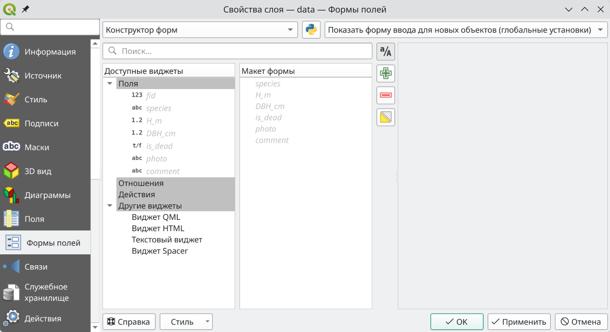{#fig-form}

Нажмите на поле "species", в правой части окна появятся настройки поля. В подразделе "Общие" > "Псевдоним" введите название "Вид дерева". Это псевдоним, который будет отображаться вместо изначального названия поля. В подпункте "Вид формы" из выпадающего списка выберите "Карта значений", эта настройка позволит создать список с выбором пород. Заполним его несколькими породами деревьев как показано на рисунке ниже.

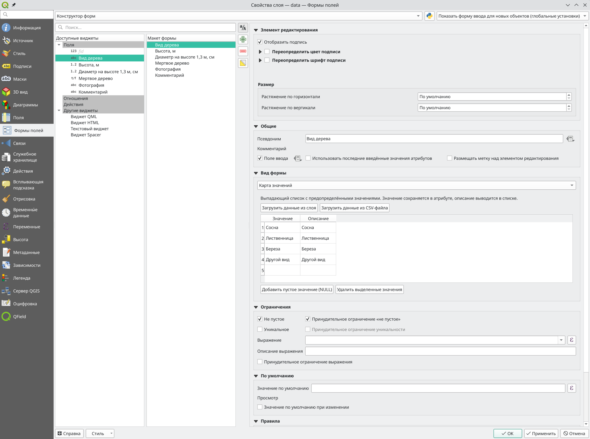{#fig-species}

В подпункте "Ограничения" поставьте два чек-бокса в пунктах "Не пустое" и "Принудительное ограничение Не пустое". Это сделает поле обязательным для заполнения. Если поле не заполнено, новый объект сохранить будет невозможно. Похожим образом насатраиваются остальные поля, но некоторые настройки будут отличаться.

В настройках поля "H_m" укажите псевдоним "Высота, м", "Вид формы" > "Диапазон". Так же задайте допустимые минимальное (0) и максимальное (50) значения и точность (1). Для поля "DBH_cm" проведите аналогичные настройки: "Псевдоним" - "Диаметр на высоте 1,3 м, см"; "Вид формы" - "Диапазон"; минимальное значение - 0; максимальное значение - 150; точность - 1.

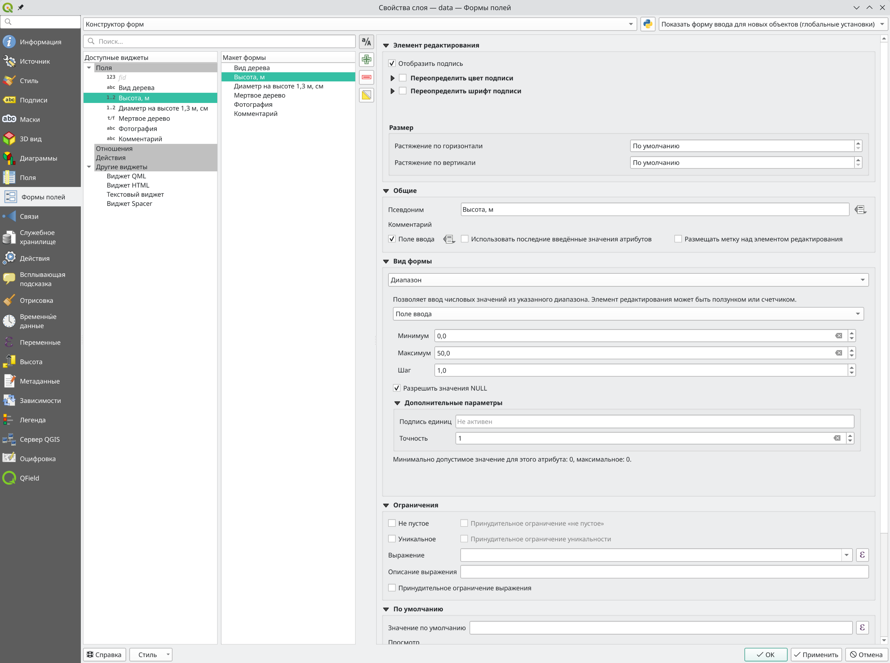{#fig-H_m}

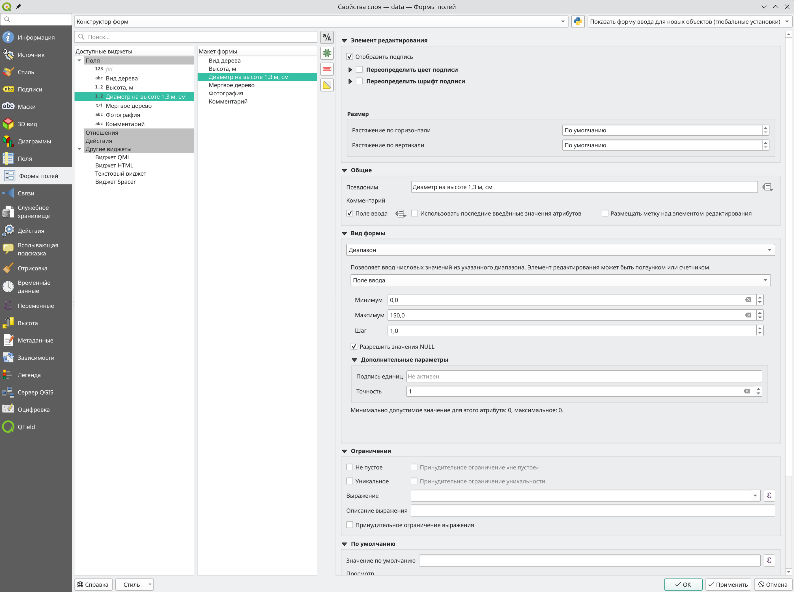{#fig-DBH_cm}

В поле "is_dead" проведите следующие настройки: "Псевдоним" - "Мертвое дерево"; "Вид формы" - "Флажок".

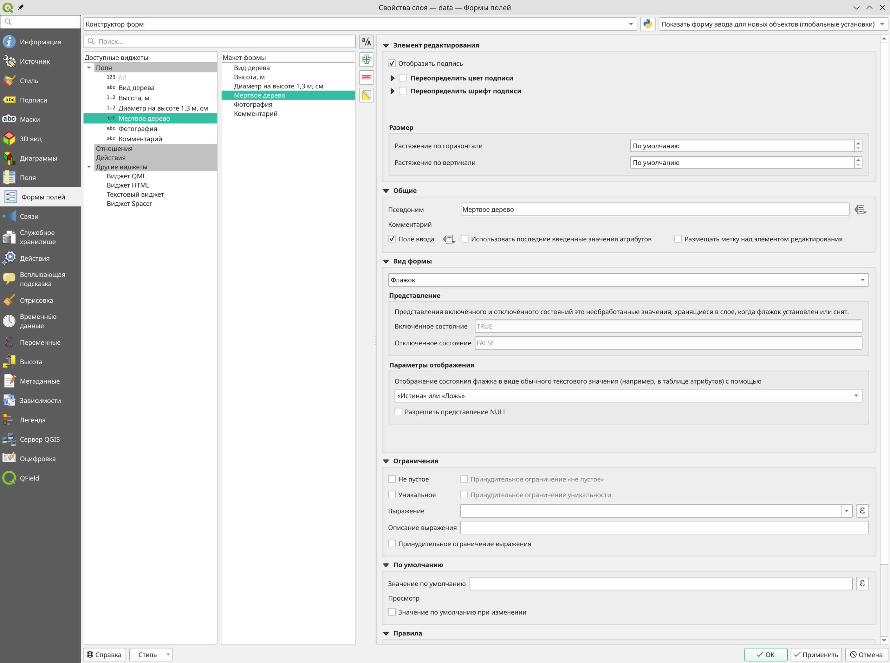{#fig-is_dead}

В поле "photo" проведем настройки для хранения ссылок на фотографии. Для начала в папке прокета создайте папку "DCIM", в эту папку будут сохраняться фотографии в то время как поле "photo" будет хранить ссылки на них. В поле "photo" проведите следующие настройки. "Псевдоним" - "Фотография", "Вид формы" - "Вложение". В пункте "Путь по умолчанию" введите "/DCIM/" (без кавычек), так мы укажем приложению папку для сохранения фотографий. В пункте "Хранить пути как" выберите "Относительно расположения проекта". Снимите чек-бокс в пункте "Отобразить путь к ресурсу", в подпункте "Встроенный просмотр документов" выберите "Изображение". Остальные настройки оставьте по умолчанию.

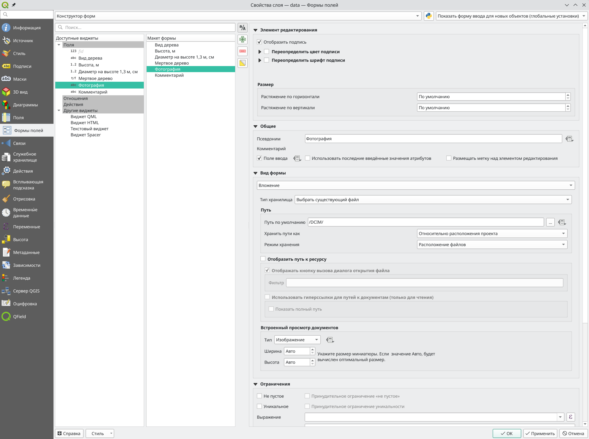{#fig-photo}

В поле "comment" можно будет ввести произвольный текст (заметку) о конкретном дереве, поэтому настроим его следующим образом: "Псевдоним" - "Комментарий", "Вид формы" - "Текстовое поле". Остальные настройки оставьте по умолчанию.

::: {.callout-note}
## Обратите внимание!
Мы рассмотрели пример настройки полей для сбора данных различного типа. Вы можете создать произвольное количество полей под ваши задачи и задать необходимые настройки. Кроме того, вы можете добавить больше векторных слоев и задать для них стили отображения. То что вы видите в QGIS будет перенесено в приложение QField практически без ограничений. За дополнительной информацией по работе с QField обратитесь к официальной документаци приложения [QField](https://docs.qfield.org/).
:::

## Настройки экспорта проекта

::: {#task-task .callout-tip}
Перед настройкой экспорта сохраните проект.
:::

Вами уже были настроены стили отображения и слои для сбора данных. Осталось настроить экспорт проекта в плагине "QField Sync". Перейдите в пункт **"Модули" > "QField Sync" > "Configure current project"**. В окне доступно две вкладки конфигурирования проекта, в зависимости от способа переноса проекта в мобильное устройство: "QFieldCloud Packaging" - если вы используюте облачный сервер "QFieldCloud"; "Cable Packaging" - при копировании проекта напрямую (не обязательно через проводное соединение, можно отправить заархивированный проект, например, через облако). В этом примере мы будем использовать вкладку "Cable Packaging".

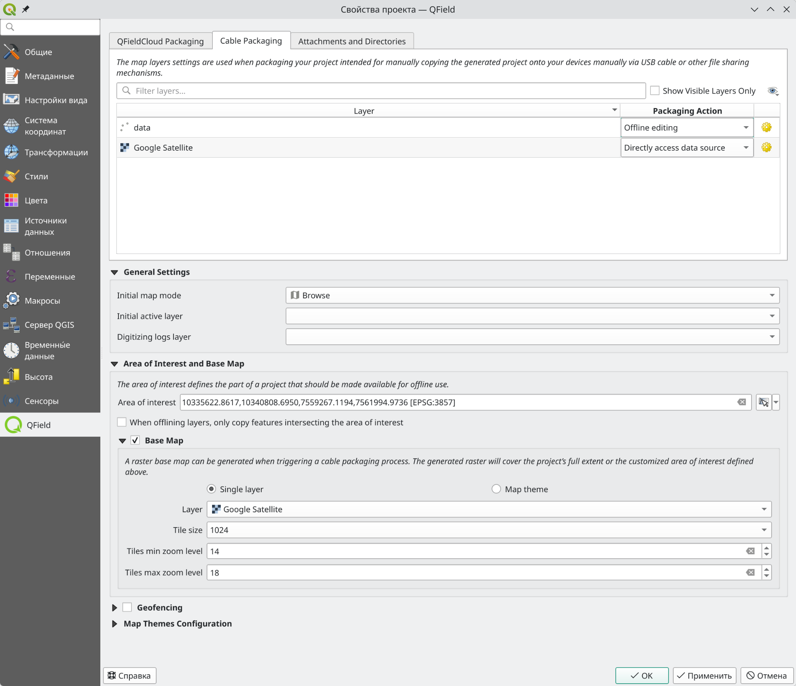{#fig-qgis_export_settings}

В верхней части окна производится настройка для каждого слоя. Возможны 4 режима:

+ "Copy" - слой будет скопирован в новый проект;
+ "Offline editing" - слой будет подготовлен для редактирования;
+ "Directly access data source" - загрузка слоя из интернета (например для Google Satellite);
+ "Remove from project" - слой будет удален из проекта.

Напротив слоя "data" выберите режим "Offline editing", напротив слоя "Google Satellite" выберите режим "Directly access data source" (в таком режиме базовая карта будет доступна, но только при наличии интернета).

## Оффлайн базовая карта

При сборе плевых данных не всегда есть доступ к интернету, поэтому полезно иметь часть базовой карты в режиме оффлайн. Для сохранения части карты Google Satellite расположите главное окно программы над интересующей вас областью (не нужно выбирать слишком большой участок, оптимальный масштаб 1:10 000). Теперь перейдите в пункт **"Модули" > "QField Sync" > "Configure current project"**, в подпункте "Area of Interest and Base Map" > "Area of Interest" выберите "Текущий охват карты", поле будет заполнено координатами, ограничивающими область загрузки карты. Поставьте чек-бокс в подпункте "Base Map", ниже задаются настройки загрузки базовой карты: выберите режим "Single layer"; в поле "Layer" выберите слой "Google Satellite". Пункты "Tiles min zoom levels" и "Tiles max zoom levels" влияют на детальнотость загруженной карты. Всего карты Google Satellite поддерживают уровни от 0 до 22, где 22 - наиболее детальный. В этих пунктах зададим "Tiles min zoom levels" - 14, "Tiles max zoom levels" - 18. Настройка закончена, нажмите "Применить" > "ОК".

## Импорт проекта в QField (Android)

После настройки проекта, выполним экспорт. По сути это будет копия текущего проекта с настройками для приложения QField, которыю мы в последствии скопируем на мобильное устройство. Перейдите в пункт **"Модули" > "QField Sync" > "Package for QField"**, выберите папку для сохранения проекта и нажмите **"Create"**. Копия проекта, сконфигурированная для использования в QField, будет сохранена в указанную папку.

::: {#task-task .callout-tip}
Экспортируйте проект в папку на рабочем столе. Экспорт может занять некоторое время из-за загрузки базовой карты.
:::

Сконфирурированную копию проекта необходимо скопировать на мобильное устройство (например в папку "Downloads"). Сделать это можно через проводное соединение или облачный сервис. Далее работа проводится на мобильном устройстве, откройте приложение QField. На главном экране выберите пункт "Local projects and datasets" > нажмите на символ "+" в правом нижнем углу > "Импорт проекта из папки" > выберите папку с проектом и нажмите "Использовать эту папку" > "Разрешить" > "Нажмите на файл проекта". Проект успешно импортирован в приложение QField.

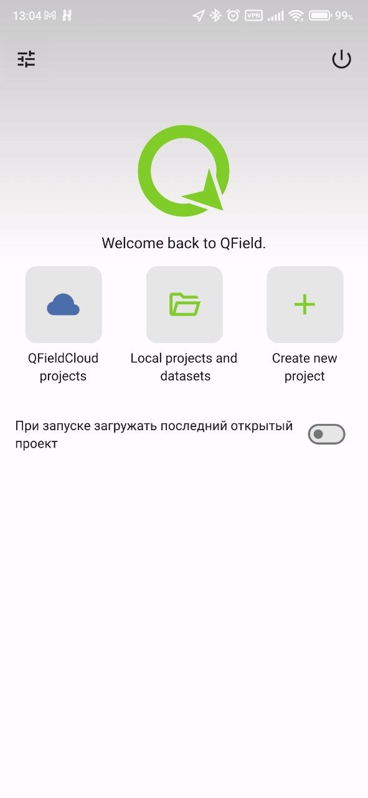{#fig-home_screen width=50% .border}

## QField - Навигация и сбор данных

Приложение QField позволяет решить две основные задачи: ориентирование на местности (навигация) и сбор полевых данных. В соответствии с этими задачами приложение имеет 2 режима: просмотра {.image-bg} и оцифровки (редактирования) 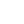{.image-bg}. Переключатель режимов находится в нижней части панели слоев (нажмите на иконку с тремя горизонтальными линиями в левом верхнем углу). Эти режимы аналогичны таковым в QGIS. В панеле слоев возможно настроить отображение слоя (иконка  напротив каждого слоя) а так же задать некоторые дополнительные насатройки (длительное нажатие на слой). Иконка " Return home" возвращает на главный экран.

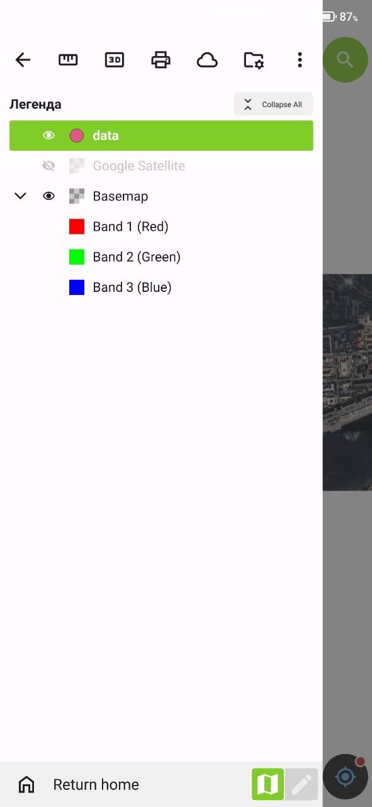{#fig-qfield_layers width=50% .border}

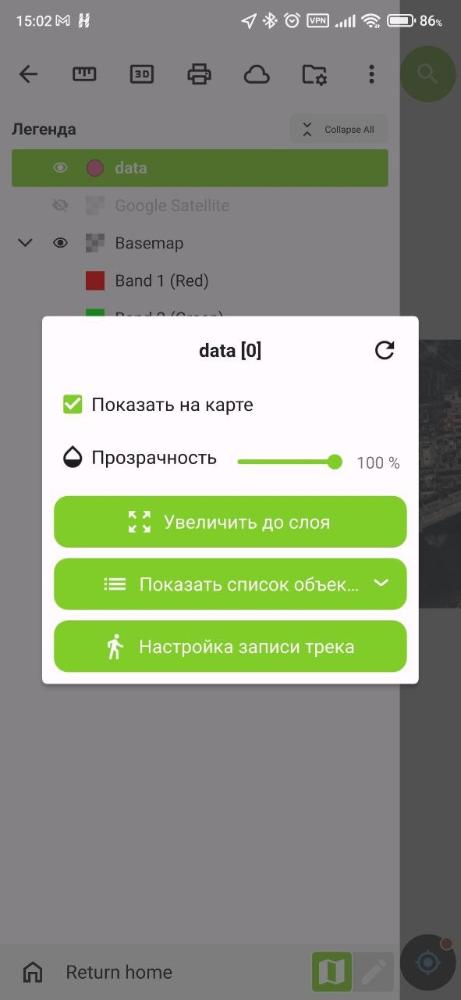{#fig-menu width=50% .border}

В основном окне, нажатие на иконку 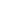{.image-bg} перемещает охват карты к вашему местположению (определяется по GPS). Нажание на точку с вашим местоположением открывает круговое меню настроек:

- Блокировка / разблокировка курсора ввода 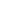{.image-bg} - важная функция при оцифровке (добавлении новых объектов), заблокированный курсор добавляет новый объект (или вершину) в точке вашего текущего местположения. Разблокированный курсор позволяет добавить объект (вершину) в произвольном месте.
- Блокировка / разблокировка охвата карты 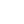{.image-bg} - при заблокированном охвате, карта будет возвращаться к вашему текущему положению. Эта функция удобна если вы следуете по маршруту и хотите быстро осмотреть окрестности на карте.
- Добавление закладки  - позволяет добавить закладку с комментарием. Такими закладками удобно помечать временные точки, например местоположение машины на которой вы приехали или вашего лагеря.
- Копировать координаты  - копирует ваши координаты в буфер обмена. Их можно вставить в сообщение.
- Информация о местоположении  - выводит на экран расширенную информацию о текущем местоположении.
- Трекинг  - позволяет записывать маршрут (трек). Запись может происходить в фоновом режиме.

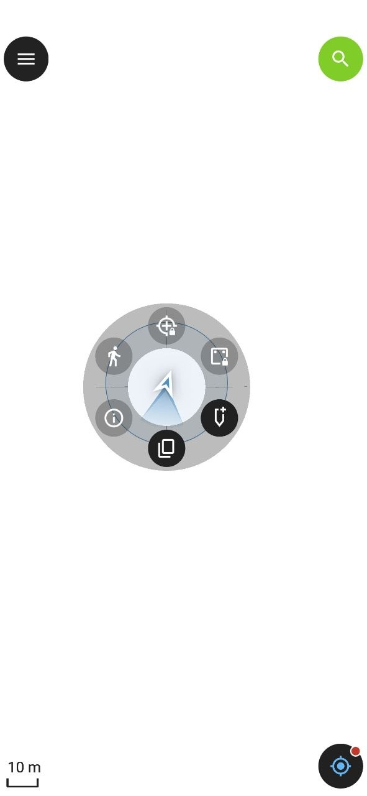{#fig-circle_menu width=50% .border}

Как уже упоминалось, режим редактирования имеет два подрежима. Когда курсор ввода разблокирован вы можете добавить новый объект (вершину) в любую точку на карте, достаточно навести на эту точку перекрестие {.image-bg} и нажать на иконку {.image-bg} в правом нижнем углу. Когда курсор ввода заблокирован, при нажатии на иконку {.image-bg} объект (вершина) добавляется в текущем местоположении.

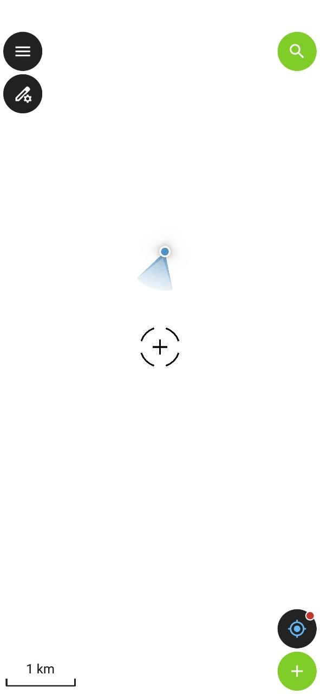{#fig-cursor width=50% .border}

::: {.callout-note}
## Обратите внимание!
По аналогии с QGIS, новый объект добавляется в выделенный слой в панеле слоев.
:::

После добавления обьекта в приложении появится форма ввода атрибутов, которую нужно заполнить. В нашем случае обязательно для заполнения поле "Вид дерева" (без его заполнения сохранить объект не получится). Ранее мы настроили для этого поля режим выпадающего списка, поэтому значения ограничены предзаданными категориями. После заполнения поля "Вид дерева" иконка {.image-bg} в левом верхнем углу станет зеленой, это значит что все обязательные поля заполнены и, нажав на иконку, можно сохранить объект. Так же объект можно удалить, нажав на иконку {.image-bg} в правом верхнем углу.

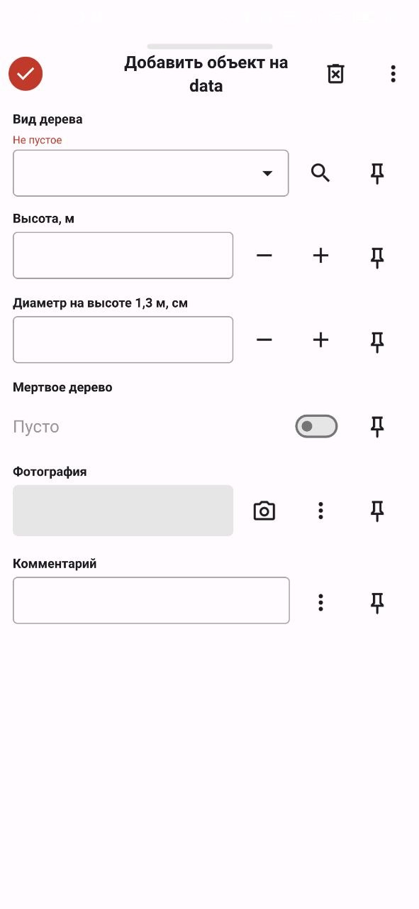{#fig-forma width=50% .border}

::: {#task-task .callout-tip}
Добавьте 3 дерева в приложение QField. Заполните все поля (характеристики) для каждого дерева.
:::

## Экспорт в QGIS

После сбора данных, проект необходимо экспортировать обратно в QGIS. Для этого с главного экрана приложения QField перейдите в пункт "Local projects and datasets" > "Импортированные проекты", напротив проекта нажмите на иконку , выберите пункт "Экспорт в папку..." и сохраните проект в папку "Downloads" на вашем телефоне. Эту папку необходимо скопировать на компьютер. Экспорт завершен

::: {#task-task .callout-tip}
Экспортируйте проект из QField в QGIS. Откройте проект в QGIS и убедитесь что в файле "data.gpkg" появлились новые, добавленные вами, объекты и атрибуты к этим объектам. Убедитесь что фотографии находятся в папке "DCIM".
:::

Мы рассмотрели базовые возможности приложения QField. Для более глубокого изучения возможностей обратитесь к руководству на официальном сайте приложения.

