# Каталог координат

Каталог координат - это таблица, содержащая координаты поворотных точек объекта. Объект может иметь геометрическую форму точки (в этом случае достаточно пары координат), линии или полигона (см. @tbl-coords_example). Так же каталог координат может содержать сразу несклько объектов. В этом случае кроме координат должен присутствовать столбец, позволяющий идентифицировать объекты. Геометрическая форма объектов а так же система координат должны быть известны заранее или прописаны в заголовке каталога координат. Без этой информации использовать каталог в ГИС невозможно.

| Порядковый номер точки | Широта, град | Долгота, град|
|:----------------------:|:------------:|:------------:|
|1                       |95.561182     |56.668171     |
|2                       |95.722211     |56.711855     |
|3                       |95.712236     |56.846833     |
|4                       |95.661184     |56.542115     |

: Пример каталога координат (Система координат WGS84) {#tbl-coords_example}

С применением каталога координат решается две основные задачи:

1. Импорт каталога координат в QGIS. Например, если получены координаты поворотных точек лесосеки и стоит задача отобразить их на карте в виде полигона или рассчитать площадь.
2. Экспорт уже имеющихся объектов из QGIS в каталог координат. При заполнении лесной декларации требуется указать координаты запланированных мероприятий.

В этом разделе мы рассмотрим эти две задачи на примере импорта полигона и рассчета его площади а так же экспортируем полигон в каталог координат.

::: {.callout-note}
## Загрузите файлы!
Для выполнения заданий из этого раздела загрузите файлы по [ссылке](https://disk.yandex.ru/d/wg-jCOMpp18rOg) и создайте новый проект:

- Создайте новую папку проекта под названием "Раздел координаты" а так же новый проект в QGIS;
- Сохраните файл проекта в папку проекта. 
:::

## Импорт каталога координат

Файл "Полигон.xlsx" содержит каталог координат поворотных точек лесосеки в системе координат WGS84 (EPSG:4326). Каталог координат имеет следующие столбцы:

- n - порядковый номер точки;
- lat - широта, от англ. latitude;
- lon - долгота, от англ. longitude.

Так же обратим внимание на формат координат - это десятичные градусы с запятой в роли десятичного разделителя. Эта характеристика поможет нам при импорте каталога координат в QGIS.

::: {#task-task .callout-tip}
Изучите каталог координат. Для этого откройте файл **"Полигон.xlsx"** в табличном редакторе (Excel, LibreОffice Calc и др.).
:::

Теперь сохраним таблицу в файл с расширением .csv (Comma-Separated Values). При сохранении нужно выбрать символ разелителя полей (англ. field delimiter). Самый надежный вариант - использовать символ табуляции (см. @fig-export_to_csv).

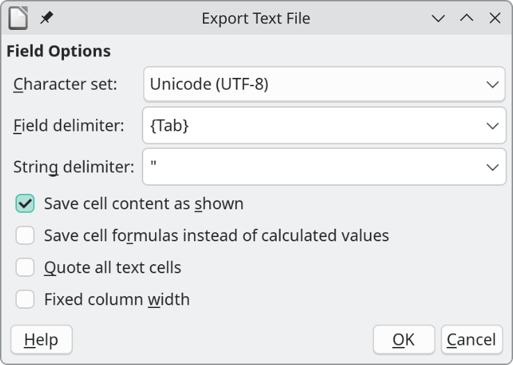{#fig-export_to_csv width=50%}

::: {#task-task .callout-tip}
Экспортируйте файл **"Полигон.xlsx"** в формат **.csv**.
:::

Теперь можно приступать к импорту **".csv"** файла в QGIS. Перейдите в пункт меню **"Слой" > "Добавить слой" > "Добавить слой из текста с разделителями..."**. В открывшемся окне необходимо задать параметры импорта файла (см. @fig-import_csv):

- "Имя файла" - указывается путь к файлу .csv;
- "Формат файла" - указывается пункт "Другие разделители" т.к. мы использовали не стандартный разделитель, запятую, а знак табуляции (поставить чек-бокс напротив пункта "Табуляция").
- в пункте "Параметры записей и полей" проставить чек-боксы напротив пунктов "Загружать имена полей из первой строки" и "Использовать десятичную запятую" (по умолчанию программа ожидает точку в роли десятичного разделителя).
- в пункте "Формат геометрии" необходимо выбрать пункт "Координаты точки" в котором указать поля с координатами ("Поле Х" - долгота, "Поле Y" - широта) и "Систему координат геометрии" - WGS84 (EPSG:4326).
- остальные пункты оставить по умолчанию.

Пункт "Примеры данных" позволяет оценить правильность распознавания таблицы. В случае некорректного отображения таблицы подберите подходящий разделитель. После всех настроек нажмите "Добавить" в правом нижнем углу окна. Новый точечный слой будет добавлен в панель слоев. Таблица атрибутов новго слоя будет соответствовать импортированной таблице.

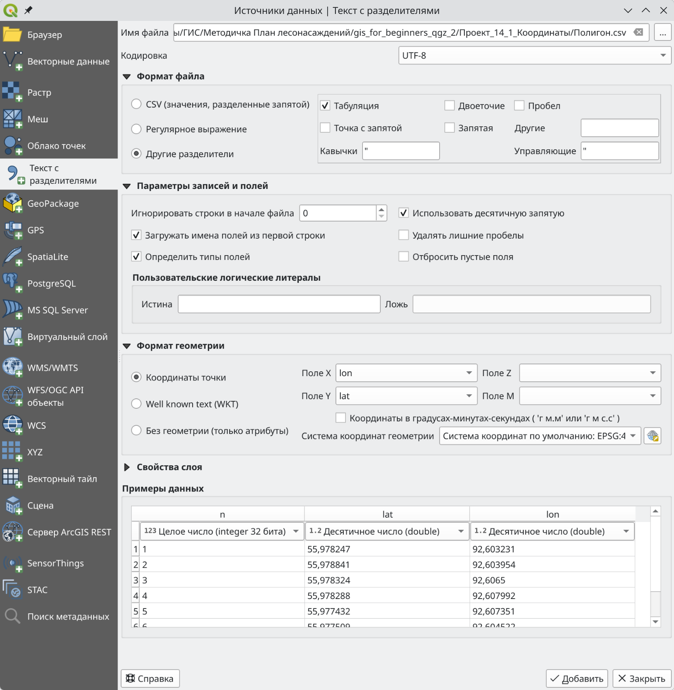{#fig-import_csv}

::: {#task-task .callout-tip}
По примеру выше импортируйте файл **.csv** в QGIS.
:::

::: {.callout-note}
## Обратите внимание!
Каталог координат может содержать неограниченное количество столбцов. Кроме обязательной пары столбцов с координатам, могут присутствовать дополнительные столбцы с характеристиками точек. В нашем примере такой дополнительный столбец ("n") содержит порядковый номер точки. При импорте в QGIS дополнительные столбцы сохраняются и становятся частью таблицы атрибутов слоя точек. Это может быть полезно при решении некоторых задач.
:::

Мы успешно импортировали поворотные точки лесосеки, однако, что бы рассчитать площадь объект должен быть полигоном а не набором точек. Теперь задача состоит в том, что бы превратить точки в полигон. В QGIS такое преобразование включает промежуточный этап: точки конвертируются в линию после чего линия конвертируется в полигон.
Используем инструмент **"Точки в контур"** в панеле инструментов для создания замкнутой линии. В настройках исходного слоя выберите слой с точками, поставьте чек-бокс **"Создать замкнутые контуры"** (в этом случае первая и последняя точки будут соединены). Поле **"Выражение порядка"** позволяет задать порядок соединения точек. Для этого в таблице атрибутов у каждой точки должен быть порядковый номер (в нашем случае это поле **"n"**). Если выражение порядка не задано, точки будут соединены в той последовательности в которой они представлены в таблицы атрибутов. После всех настроек нажмите "Выполнить", в панеле слоев появится новый временный слой с линией (@fig-points_to_line).

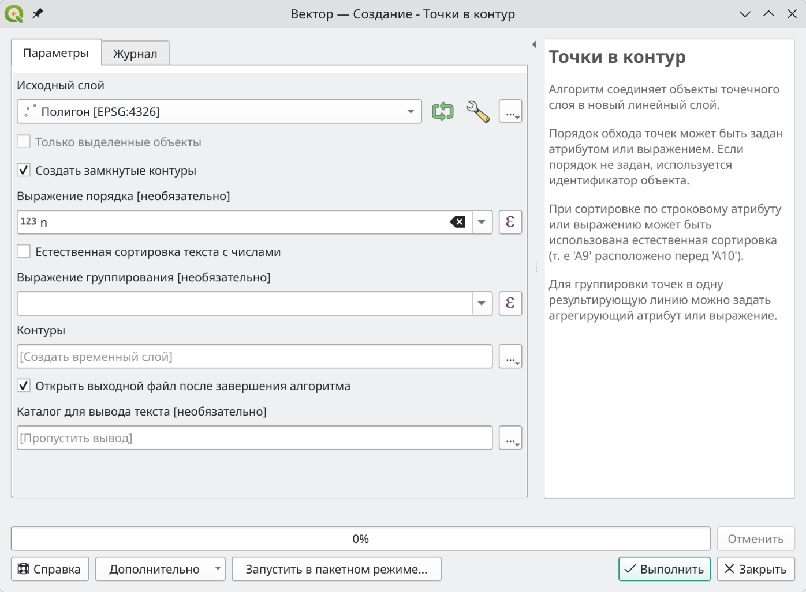{#fig-points_to_line}

::: {#task-task .callout-tip}
По примеру выше конвертируйте точечный слой в замкнутую линию.

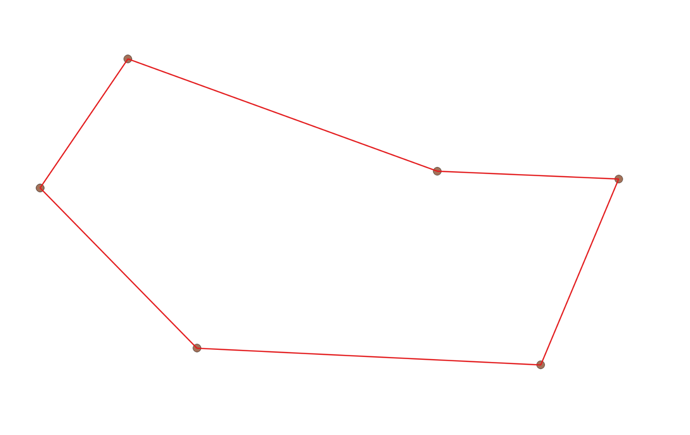{#fig-points_to_line_result width=50%}

:::

Преобразование линии в полигон выполняется при помощи инструмента **"Линии в полигоны"**. В качестве исходного слоя задается слой с линией (@fig-line_to_poly).

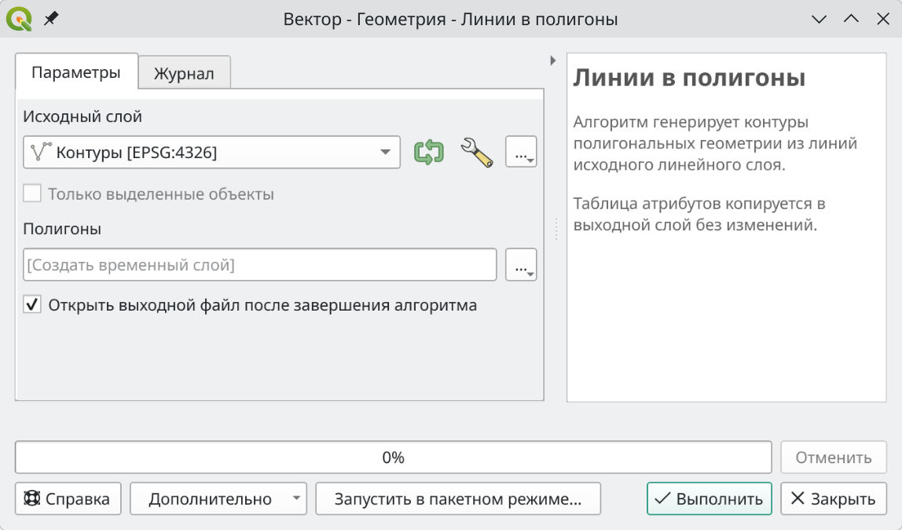{#fig-line_to_poly width=80%}

::: {#task-task .callout-tip}
Конвертируйте линию в полигон.  
Сохраните временный слой с полигоном в папку проекта.

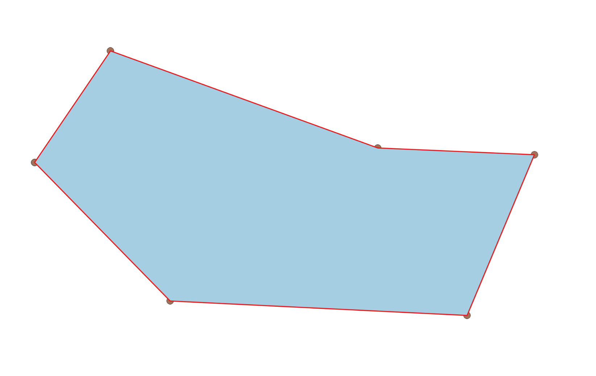{#fig-points_to_line_result width=50%}

:::

Остается рассчитать площадь полученного полигона. Такую операцию вы уже проводили в предыдущем разделе (см. @task-task_area)

::: {#task-task .callout-tip}
Рассчитайте площадь полигона в гектарах (см. @task-task_area).
:::

Теперь вы можете использовать лесосеку как любой полигональный объект. Например, если нужно узнать какие выделы подлежат рубке, вы можете использовать инструмент "Обрезать..." на слое выделов. В результате будут получены части выделов, попадающие в лесосеку.

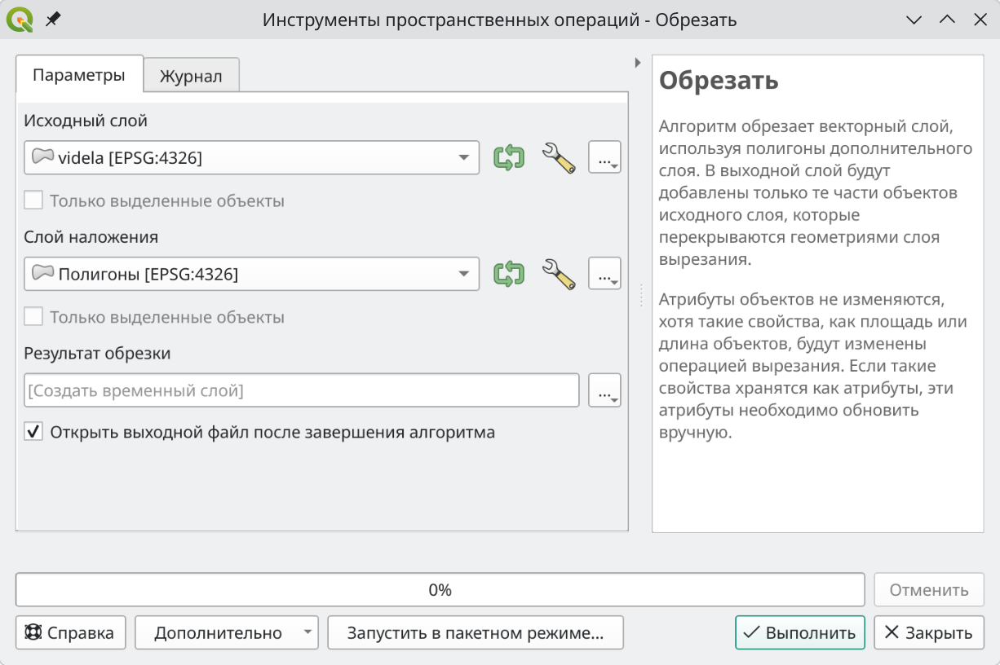{#fig-line_to_poly width=80%}

::: {#task-task .callout-tip}
Определите части каких выделов попадают в лесосеку. Для этого используйте инструмент "Обрезать". Границы выделов находятся в файле "videla.gpkg".

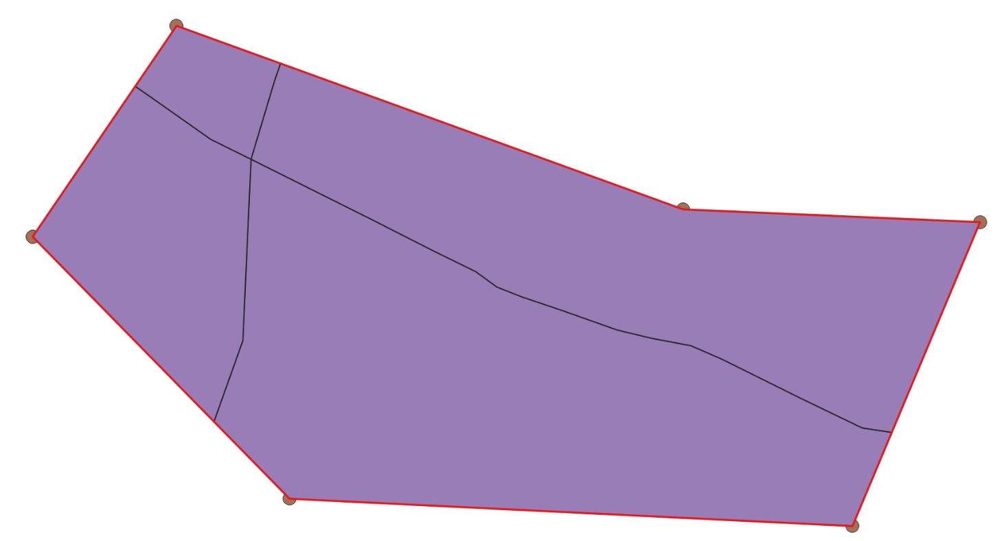{#fig-points_to_line_result width=50%}
:::

## Экспорт в каталог координат

В предыдущем разделе мы рассмотрели как построить полигон по координатам поворотных точек. Обратная задача - конвертирование полигона, линии или точек в каталог координат. Если мы работаем с линией или полигоном, задача состоит из 3-х этапов:

1. Конвертирование в точечную геометрию;
2. Расчет координат для каждой точки;
3. Экспорт в табличный формат (например Excel).

В случае с точечной геометрией первый этап пропускается. В этом разделе мы преобразуем границу выдела в каталог координат. Испольуйте инструмент **"Выбрать объекты в прямоугольнике или точке"**  что бы выбрать один выдел в слое "videla" (см. @sec-pickobj). После чего выбранный выдел будет обозначен желтым цветом. Используйте инструмент **"Извлечь вершины"** в панеле инструментов анализа что бы получить точечный слой поворотных точек выбранного выдела. В качестве исходного слоя задается слой "videla", так же необходимо поставить чек-бокс "Только выделенные объекты" что бы конвертировать в поворотные точки не все объекты слоя а только выделенные (для этого вначале нами был выбран один выдел) (@fig-extract_vertexes). В результате появится новый временный точечный слой содержащий поворотные точки (вершины) полигона.

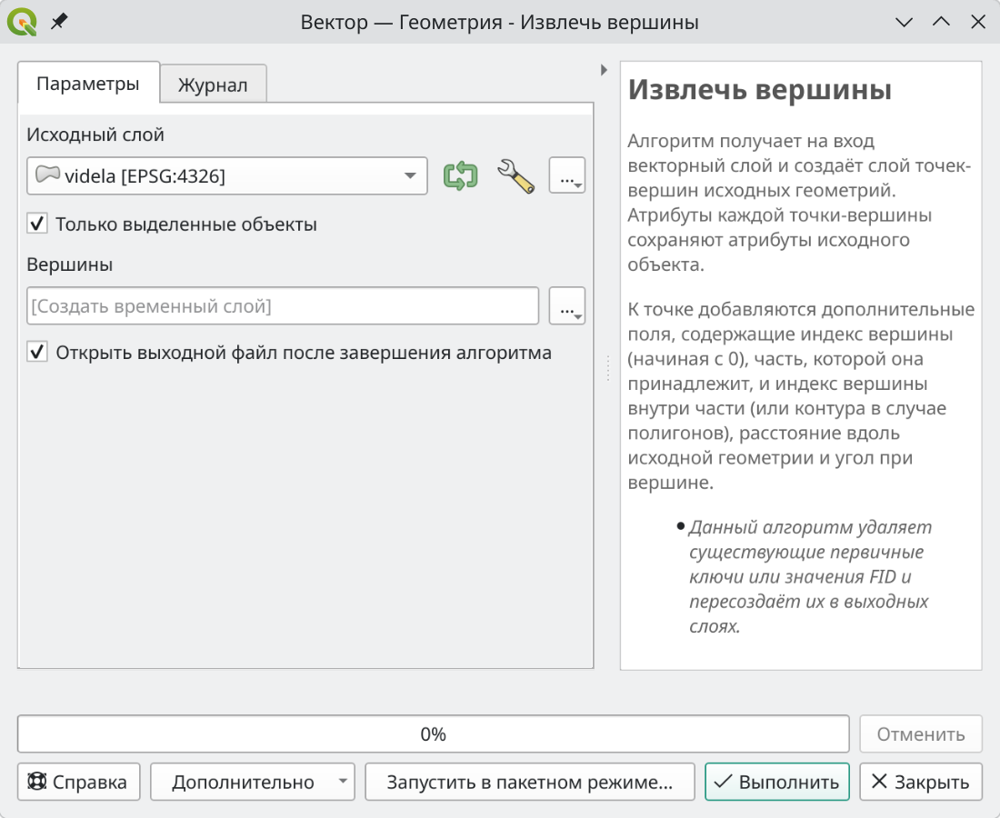{#fig-extract_vertexes width=85%}

::: {#task-task .callout-tip}
По примеру выше выделите один любой выдел и конвертируйте его в точечный слой (см. @fig-poly_to_vertex_result).

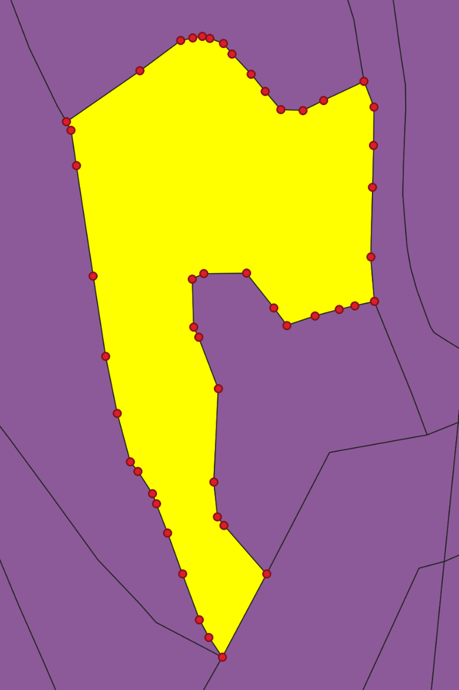{#fig-poly_to_vertex_result width=50%}
:::

Любопытные изменения произошли в атрибутивной таблице поворотных точек. Исходный слой "videla" содержал таксационную характеристику для каждого выдела. В слое поворотных точек характеристика выдела была продублирована для каждой вершины. Так же были добавлены новые столбцы: 

- "vertex_index" - порядковый номер вершины в контуре геометрии (отсчет вершин начинается с 0). Это порядок в котором вершины полигона добавлялись при его создании.
- "distance" - кумулятивное (накопленное) расстояние между вершинами начиная с 0 точки, зависит от системы координат слоя. В нашем случае слой "videla" имел географическую систему координат WGS84, поэтому расстояние было рассчитано в градусах.
- "angle" - 

Последний этап, добавление координат в таблицу атрибутов, выполняется при помощи инструмента **"Добавить к слою поля X/Y"**. В качестве исходного слоя задается точечный слой с поворотными точками, пункт **"Система координат"** определяет в какой системе будут рассчитаны координаты (см. @fig-add_coords). В результате будет создан временный слой в атрибутах которого будут указаны координаты для каждой точки (столбцы "x" и "y" в таблице атрибутов).

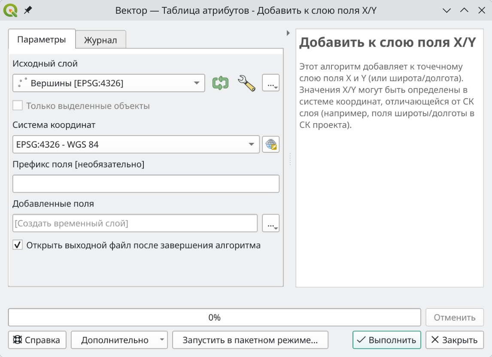{#fig-add_coords width=85%}

::: {.callout-note}
## Обратите внимание!
Для того что бы округлить координаты используйте функцию `round(value, places)`, где `value` - десятичное число, `places` - количество знаков после запятой, до которого нужно округлить `value`. Обычно географические координаты округляют до 6 знаков, спроецированные до 2-х т.к. в географической системе координаты измеряются в десятичных градусах, в спроецированной - в метрах.

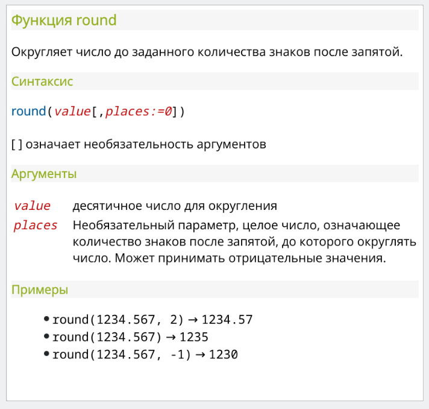{#fig-fig width=70%}

:::

После того как получены координаты для каждой точки, остается сохранить слой в таблицу. Для этого нажмите правой кнопкой мыше по слою в панеле слоев > "Экспорт" > "Сохранить объекты как...". В появившемся окне выберите "Формат" - "XLSX - электронная таблица MS Office Open XML", в пункте "Имя файла" нажмите на "..." и укажите место сохранения таблицы и ее название. В пункте "Выберите поля для экспорта" вы можете выбрать те поля, которые будут сохранены в таблицу (см. @fig-save_table). Нажмите ОК и таблица с каталогом координат будет создана.

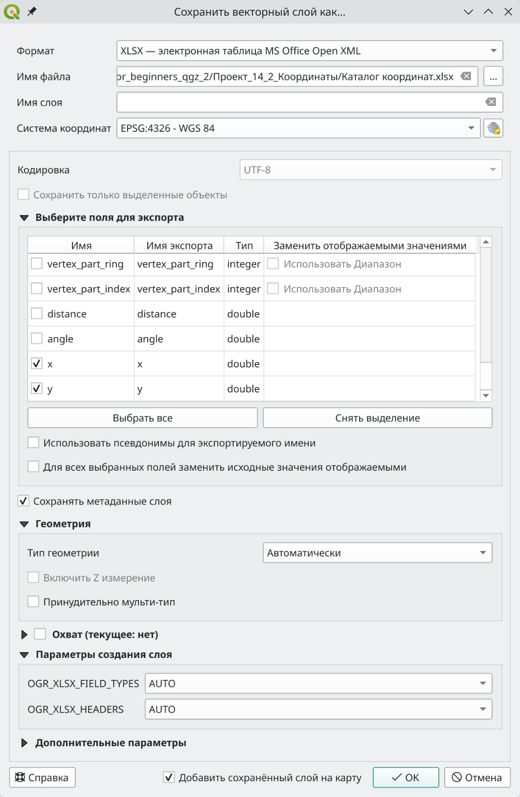{#fig-save_table width=65%}

::: {#task-task .callout-tip}
По примеру выше создайте каталог координат.

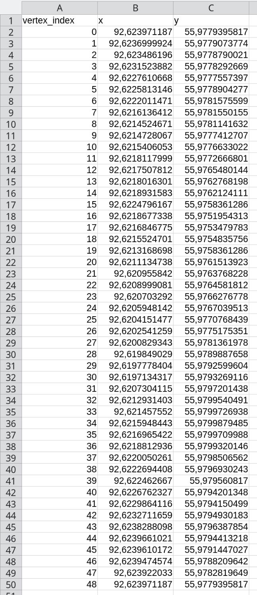{#fig-coords_table width=50%}
:::

## Полярная система координат

